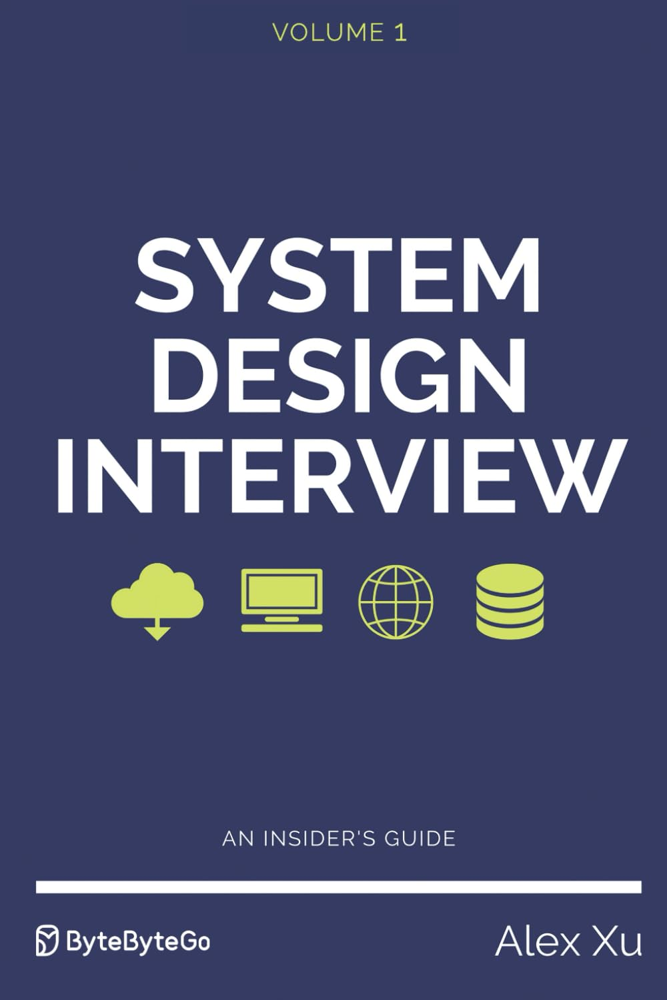

# System Design Interview – An Insider's Guide study

###### Presentation slides, resources and references of ["System Design Interview – An insider's Guide"](https://www.amazon.com/System-Design-Interview-insiders-guide/dp/B08CMF2CQF) Book

## The Book

System design interviews are the most difficult to tackle of all technical interview questions. This book is Volume 1 of the System Design Interview - An insider’s guide series that provides a reliable strategy and knowledge base for approaching a broad range of system design questions. This book provides a step-by-step framework for how to tackle a system design question. It includes many real-world examples to illustrate the systematic approach, with detailed steps that you can follow.

## Presenter

- Chris Ohk
- Chankyu Shin
- Donghyeon Yeo
- Hyunwoo Jang
- Juho Moon
- Seungrok Lee
- Sijun Seong
- Taeyoung Yoo
- Youngjun Kim
- Yuhan Park
- Yuseok Yang

## Contents (Presentation Slides - Korean)

### Chapter 1: Scale from Zero to Millions of Users

- Presenter: Skipped.

### Chapter 2: Back-of-the-Envelope Estimations

- Presenter: Skipped.

### Chapter 3: A Framework for System Design Interviews

- Presenter: Skipped.

### Chapter 4: Design a Rate Limiter

- Presenter: Youngjun Kim [[Summary]](./01%20-%20Summary/260228%20-%20System%20Design%20Interview%20–%20An%20Insider's%20Guide,%20Chapter%204.md) [[Discussion]](./02%20-%20Discussion/260228%20-%20System%20Design%20Interview%20–%20An%20Insider's%20Guide,%20Chapter%204,%205.md)

### Chapter 5: Design Consistent Hashing

- Presenter: Sijun Seong [[Summary]](./01%20-%20Summary/260228%20-%20System%20Design%20Interview%20–%20An%20Insider's%20Guide,%20Chapter%205.md) [[Discussion]](./02%20-%20Discussion/260228%20-%20System%20Design%20Interview%20–%20An%20Insider's%20Guide,%20Chapter%204,%205.md)

### Chapter 6: Design a Key-Value Store

- Presenter: Juho Moon [[Summary]](./01%20-%20Summary/260314%20-%20System%20Design%20Interview%20–%20An%20Insider's%20Guide,%20Chapter%206.pdf) [[Discussion]](./02%20-%20Discussion/260314%20-%20System%20Design%20Interview%20–%20An%20Insider's%20Guide,%20Chapter%206,%207.md)

### Chapter 7: Design a Unique ID Generator in Distributed Systems

- Presenter: Yuseok Yang [[Summary (Markdown)]](./01%20-%20Summary/260314%20-%20System%20Design%20Interview%20–%20An%20Insider's%20Guide,%20Chapter%207.md) [[Summary (HTML)]](./01%20-%20Summary/260314%20-%20System%20Design%20Interview%20–%20An%20Insider's%20Guide,%20Chapter%207.html) [[Summary (Answer)]](./01%20-%20Summary/260314%20-%20System%20Design%20Interview%20–%20An%20Insider's%20Guide,%20Chapter%207.md) [[Discussion]](./02%20-%20Discussion/260314%20-%20System%20Design%20Interview%20–%20An%20Insider's%20Guide,%20Chapter%206,%207.md)

### Chapter 8: Design a URL Shortener

- Presenter: Chris Ohk [[Summary]](./01%20-%20Summary/260328%20-%20System%20Design%20Interview%20–%20An%20Insider's%20Guide,%20Chapter%208.md) [[Discussion]](./02%20-%20Discussion/260328%20-%20System%20Design%20Interview%20–%20An%20Insider's%20Guide,%20Chapter%208,%209.md)

### Chapter 9: Design a Web Crawler

- Presenter: Hyunwoo Jang [[Summary]](./01%20-%20Summary/260328%20-%20System%20Design%20Interview%20–%20An%20Insider's%20Guide,%20Chapter%209.pdf) [[Discussion]](./02%20-%20Discussion/260328%20-%20System%20Design%20Interview%20–%20An%20Insider's%20Guide,%20Chapter%208,%209.md)

### Chapter 10: Design a Notification System

- Presenter: Chankyu Shin [[Summary]](./01%20-%20Summary/260425%20-%20System%20Design%20Interview%20–%20An%20Insider's%20Guide,%20Chapter%2010.pdf) [[Disscussion]](./02%20-%20Discussion/260425%20-%20System%20Design%20Interview%20–%20An%20Insider's%20Guide,%20Chapter%2010,%2011.md)

### Chapter 11: Design a News Feed System

- Presenter: Taeyoung Yoo [[Disscussion]](./02%20-%20Discussion/260425%20-%20System%20Design%20Interview%20–%20An%20Insider's%20Guide,%20Chapter%2010,%2011.md)

### Chapter 12: Design a Chat System

- Presenter: Donghyeon Yeo [[Summary]](./01%20-%20Summary/260509%20-%20System%20Design%20Interview%20–%20An%20Insider's%20Guide,%20Chapter%2012.pdf)

### Chapter 13: Design a Search Autocomplete System

- Presenter: Yuhan Park [[Summary]](./01%20-%20Summary/260509%20-%20System%20Design%20Interview%20–%20An%20Insider's%20Guide,%20Chapter%2013.md)

### Chapter 14: Design Youtube

- Presenter: TBA

### Chapter 15: Design Google Drive

- Presenter: TBA

### Chapter 16: The Learning Continues

- Presenter: TBA
