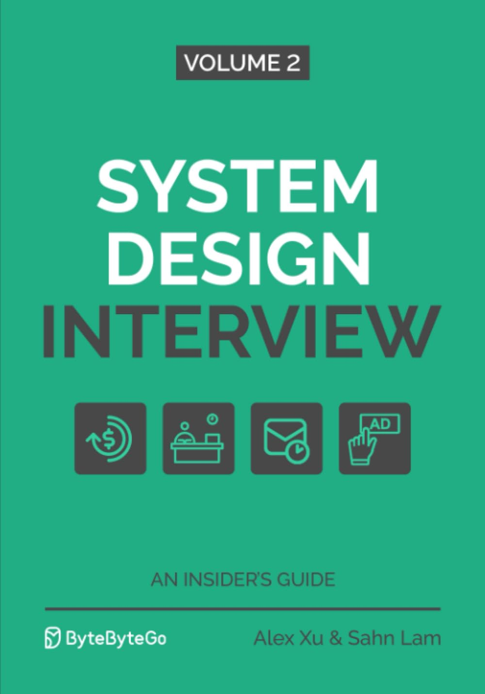

# System Design Interview – An Insider's Guide: Volume 2

###### Presentation slides, resources and references of ["System Design Interview – An insider's Guide: Volume 2"](https://www.amazon.com/System-Design-Interview-Insiders-Guide/dp/1736049119) Book

## The Book

This book can be seen as a sequel to the book: System Design Interview - An Insider’s Guide. It covers a different set of system design interview questions and solutions. Although reading Volume 1 is helpful, it is not required. This book should be accessible to readers who have a basic understanding of distributed systems.

This volume provides a reliable strategy and knowledge base for approaching a broad range of system design questions that you may encounter. It will help you feel confident during this important interview. This book provides a step-by-step framework for how to tackle a system design question. It also includes many real-world examples to illustrate a systematic approach, with detailed and well-explained steps you can follow.

What’s inside?

- An insider’s take on what interviewers really look for and why.
- A 4-step framework for solving any system design interview question.
- 13 real system design interview questions with detailed solutions.
- 300+ diagrams to visually explain how different systems work.

## Presenter

- Chris Ohk
- Donghyeon Yeo
- Juho Moon
- Seungrok Lee
- Sijun Seong
- Yuhan Park
- Yuseok Yang
- Seonghyun
- Hoyeon
- Seungmin
- Seojin

## Contents (Presentation Slides - Korean)

### Chapter 1: Proximity Service

- Presenter: TBA

### Chapter 2: Nearby Friends

- Presenter: TBA

### Chapter 3: Google Maps

- Presenter: TBA

### Chapter 4: Distributed Message Queue

- Presenter: TBA

### Chapter 5: Metrics Monitoring

- Presenter: TBA

### Chapter 6: Ad Click Event Aggregation

- Presenter: TBA

### Chapter 7: Hotel Reservation

- Presenter: TBA

### Chapter 8: Distributed Email Service

- Presenter: TBA

### Chapter 9: S3-like Object Storage

- Presenter: TBA

### Chapter 10: Real-time Gaming Leaderboard

- Presenter: TBA

### Chapter 11: Payment System

- Presenter: TBA

### Chapter 12: Digital Wallet

- Presenter: TBA

### Chapter 13: Stock Exchange

- Presenter: TBA
